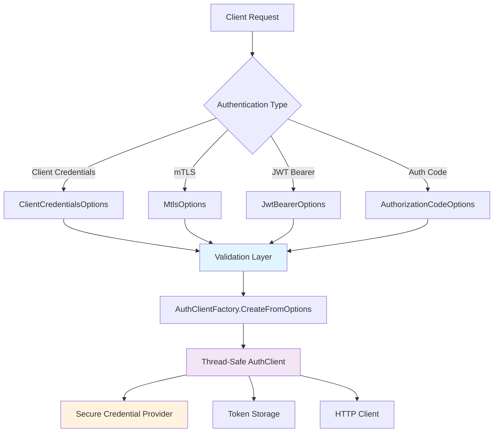
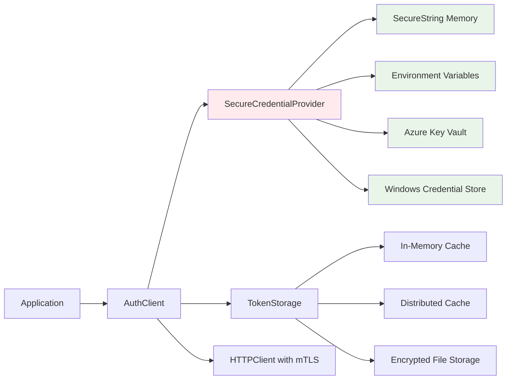

# Enhanced Authentication Client Architecture

## Overview

This document showcases the enhanced authentication client architecture for the CoyoteSense platform. The improvements focus on **maintainability**, **security**, **thread safety**, and **modern .NET patterns**.

## 🎯 Key Improvements

### 1. **Options Pattern Implementation**
- **Problem**: Factory methods with many parameters become unwieldy
- **Solution**: Strongly-typed options classes with validation
- **Benefits**: Better maintainability, automatic validation, clean configuration

```csharp
// ✅ NEW: Clean options pattern
var mtlsOptions = new MtlsOptions
{
    ServerUrl = "https://auth.coyotesense.io",
    ClientId = "my-service",
    ClientCertPath = "/opt/certs/client.crt",
    ClientKeyPath = "/opt/certs/client.key",
    DefaultScopes = new List<string> { "keyvault.read" },
    AutoRefresh = true,
    TimeoutMs = 30000
};

using var client = AuthClientFactory.CreateFromOptions(mtlsOptions);

// ❌ OLD: Many parameters, no validation
using var oldClient = AuthClientFactory.CreateMtlsClient(
    "https://auth.coyotesense.io", "my-service", 
    "/opt/certs/client.crt", "/opt/certs/client.key",
    new List<string> { "keyvault.read" }, null, null, null);
```

### 2. **Enhanced Security for Credentials**
- **Problem**: Sensitive credentials stored in plain text
- **Solution**: SecureString-based credential provider
- **Benefits**: Memory encryption, secure disposal, audit trail

```csharp
// ✅ Secure credential handling
using var credentialProvider = new SecureCredentialProvider();
credentialProvider.SetClientSecret(Environment.GetEnvironmentVariable("CLIENT_SECRET"));

using var client = AuthClientFactory.CreateWithSecureCredentials(
    config, credentialProvider);
```

### 3. **Thread Safety Improvements**
- **Problem**: Race conditions in token management and factory state
- **Solution**: SemaphoreSlim for async operations, lock-free patterns
- **Benefits**: Safe concurrent usage, better performance

```csharp
// Enhanced AuthClient with thread-safe token management
private readonly SemaphoreSlim _tokenLock = new(1, 1);
private volatile AuthToken? _currentToken;

public async Task<AuthToken> GetValidTokenAsync()
{
    await _tokenLock.WaitAsync();
    try 
    {
        // Thread-safe token operations
        return await EnsureValidTokenAsync();
    }
    finally 
    {
        _tokenLock.Release();
    }
}
```

### 4. **Dependency Injection Integration**
- **Problem**: Manual object creation and lifecycle management
- **Solution**: Extension methods for clean DI registration
- **Benefits**: Better testability, lifecycle management, configuration binding

```csharp
// ✅ Clean DI registration
services.AddAuthClientWithMtls(options =>
{
    options.ServerUrl = configuration["Auth:ServerUrl"];
    options.ClientId = configuration["Auth:ClientId"];
    options.ClientCertPath = configuration["Auth:CertPath"];
    options.ClientKeyPath = configuration["Auth:KeyPath"];
});

// ✅ Automatic configuration binding
services.Configure<MtlsOptions>(configuration.GetSection("Auth:Mtls"));
services.AddAuthenticationServices();
```

## 🏗️ Architecture Overview

### Factory Pattern Evolution



### Security Architecture



## 🔧 Usage Patterns

### Pattern 1: Options Pattern (Recommended)

```csharp
// Configuration binding from appsettings.json
{
  "Auth": {
    "Mtls": {
      "ServerUrl": "https://auth.coyotesense.io",
      "ClientId": "trading-service",
      "ClientCertPath": "/opt/coyote/certs/client.crt",
      "ClientKeyPath": "/opt/coyote/certs/client.key",
      "DefaultScopes": ["trading.read", "trading.write"],
      "AutoRefresh": true,
      "RefreshBufferSeconds": 300,
      "TimeoutMs": 30000,
      "MaxRetryAttempts": 3,
      "VerifySsl": true
    }
  }
}

// Service registration
services.Configure<MtlsOptions>(configuration.GetSection("Auth:Mtls"));
services.AddScoped<IAuthClient>(provider =>
{
    var options = provider.GetRequiredService<IOptions<MtlsOptions>>();
    return AuthClientFactory.CreateFromOptions(options.Value);
});
```

### Pattern 2: Multiple Authentication Flows

```csharp
// Client pool for managing multiple auth flows
public class TradingService
{
    private readonly AuthClientPool _authPool;
    
    public TradingService(AuthClientPool authPool)
    {
        _authPool = authPool;
    }
    
    public async Task ExecuteTradeAsync()
    {
        // Use mTLS for external broker API
        var brokerClient = _authPool.GetMtlsClient("broker", _brokerMtlsOptions);
        var brokerToken = await brokerClient.GetValidTokenAsync();
        
        // Use client credentials for internal services
        var internalClient = _authPool.GetClientCredentialsClient("internal", _internalOptions);
        var internalToken = await internalClient.GetValidTokenAsync();
        
        // Execute trade with both tokens
        await ExecuteTradeWithTokens(brokerToken, internalToken);
    }
}
```

### Pattern 3: Secure Credential Management

```csharp
public class ProductionAuthSetup
{
    public static void ConfigureAuthentication(IServiceCollection services, IConfiguration config)
    {
        // Load credentials from secure sources
        services.AddSingleton<SecureCredentialProvider>(provider =>
        {
            var credProvider = new SecureCredentialProvider();
            
            // Load from Azure Key Vault in production
            var keyVaultClient = provider.GetRequiredService<IKeyVaultClient>();
            var clientSecret = await keyVaultClient.GetSecretAsync("client-secret");
            credProvider.SetClientSecret(clientSecret.Value);
            
            return credProvider;
        });
        
        // Register authentication client with secure credentials
        services.AddScoped<IAuthClient>(provider =>
        {
            var config = provider.GetRequiredService<AuthClientConfig>();
            var credProvider = provider.GetRequiredService<SecureCredentialProvider>();
            
            return AuthClientFactory.CreateWithSecureCredentials(config, credProvider);
        });
    }
}
```

## 🚀 Migration Guide

### Step 1: Update Factory Calls

```csharp
// Before (Legacy)
var client = AuthClientFactory.CreateMtlsClient(
    serverUrl, clientId, certPath, keyPath, scopes);

// After (Options Pattern)
var options = new MtlsOptions
{
    ServerUrl = serverUrl,
    ClientId = clientId,
    ClientCertPath = certPath,
    ClientKeyPath = keyPath,
    DefaultScopes = scopes
};
var client = AuthClientFactory.CreateFromOptions(options);
```

### Step 2: Enable Dependency Injection

```csharp
// Program.cs or Startup.cs
services.AddAuthClientWithMtls(options =>
{
    configuration.GetSection("Auth:Mtls").Bind(options);
});

services.AddAuthenticationServices();
```

### Step 3: Update Configuration

```json
{
  "Auth": {
    "Mtls": {
      "ServerUrl": "https://auth.coyotesense.io",
      "ClientId": "my-service",
      "ClientCertPath": "/opt/certs/client.crt",
      "ClientKeyPath": "/opt/certs/client.key",
      "DefaultScopes": ["api.read", "api.write"],
      "AutoRefresh": true,
      "RefreshBufferSeconds": 300,
      "TimeoutMs": 30000,
      "MaxRetryAttempts": 3,
      "RetryDelayMs": 1000,
      "VerifySsl": true
    }
  }
}
```

## 🎯 Design Principles Validation

### ✅ SOLID Principles
- **Single Responsibility**: Each options class handles one auth flow
- **Open/Closed**: New auth methods can be added without changing existing code
- **Liskov Substitution**: All auth clients implement IAuthClient consistently
- **Interface Segregation**: Clean separation between auth flows and infrastructure
- **Dependency Inversion**: Depends on abstractions, not implementations

### ✅ Security Best Practices
- **Credential Protection**: SecureString for sensitive data
- **Principle of Least Privilege**: Scoped access tokens
- **Defense in Depth**: Multiple security layers
- **Secure by Default**: SSL verification enabled by default

### ✅ Thread Safety
- **Immutable Configuration**: Options are read-only after creation
- **Atomic Operations**: Volatile fields for thread-safe reads
- **Synchronization**: SemaphoreSlim for async critical sections
- **Lock-Free Patterns**: ConcurrentDictionary for client pool

### ✅ Maintainability
- **Strong Typing**: Compile-time validation of configuration
- **Clear APIs**: Self-documenting method names and parameters
- **Validation**: Data annotations for automatic validation
- **Documentation**: Comprehensive XML documentation

## 🔍 Performance Considerations

### Token Caching Strategy
```csharp
// Intelligent token refresh with buffer time
private async Task<AuthToken> EnsureValidTokenAsync()
{
    var current = _currentToken;
    if (current != null && 
        current.ExpiresAt > DateTime.UtcNow.AddSeconds(_config.RefreshBufferSeconds))
    {
        return current; // Use cached token
    }
    
    // Refresh token proactively
    return await RefreshTokenAsync();
}
```

### Connection Pooling
```csharp
// HTTP client reuse for better performance using platform infrastructure
internal static ICoyoteHttpClient GetDefaultHttpClient()
{
    lock (_lock)
    {
        // Use the injected HTTP client factory if available
        if (_httpClientFactory != null)
        {
            return _httpClientFactory.CreateClient();
        }

        // Create a proper HTTP client using the platform's factory infrastructure
        var factory = new HttpFactory.HttpClientFactory(
            serviceProvider: null,
            modeOptions: Microsoft.Extensions.Options.Options.Create(new HttpClientModeOptions 
            { 
                Mode = RuntimeMode.Production 
            }),
            httpOptions: Microsoft.Extensions.Options.Options.Create(new HttpClientOptions
            {
                DefaultTimeoutMs = 30000,
                UserAgent = "CoyoteAuth/1.0",
                VerifyPeer = true,
                FollowRedirects = true,
                DefaultHeaders = new Dictionary<string, string>
                {
                    ["Accept"] = "application/json"
                }
            }),
            logger: Microsoft.Extensions.Logging.Abstractions.NullLogger<HttpFactory.HttpClientFactory>.Instance
        );
        
        return factory.CreateClient();
    }
}
```

## 📊 Benefits Summary

| Aspect | Before | After | Improvement |
|--------|--------|-------|-------------|
| **Parameter Count** | 8+ parameters | Options object | Reduced complexity |
| **Validation** | Runtime errors | Compile-time + Data annotations | Earlier error detection |
| **Security** | Plain text credentials | SecureString + Key Vault | Enhanced credential protection |
| **Thread Safety** | Basic locking | SemaphoreSlim + volatile | Better concurrency |
| **Testability** | Hard to mock | Full DI support | Easier unit testing |
| **Configuration** | Code-based | Configuration binding | Environment-agnostic |
| **Maintainability** | Monolithic factory | Modular options | Better separation of concerns |

## 🎯 Conclusion

The enhanced authentication client architecture maintains the excellent foundation of the original factory pattern while adding modern .NET patterns and enterprise-grade features:

1. **✅ Your original assessment was correct** - Factory pattern + IAuthClient interface is excellent design
2. **🚀 Enhanced with modern patterns** - Options pattern, DI integration, secure credentials
3. **🔒 Security improvements** - SecureString, credential providers, enhanced thread safety
4. **📈 Better maintainability** - Strong typing, validation, clear configuration
5. **🏗️ Enterprise ready** - DI integration, health monitoring, client pooling

The architecture now supports both simple usage (legacy factory methods) and complex enterprise scenarios (options pattern, DI, secure credential management) while maintaining backward compatibility and following Microsoft's recommended practices.
